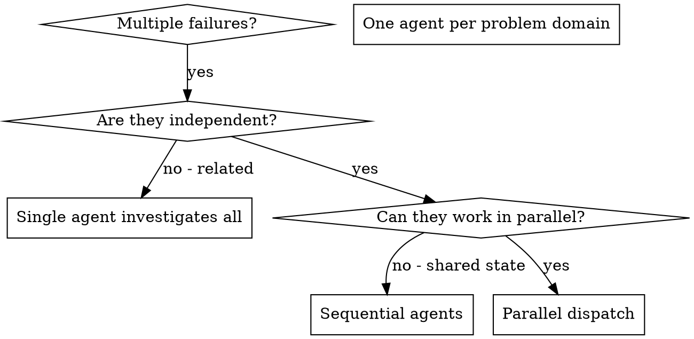

# Dispatching Parallel Agents

## Overview

You delegate tasks to specialized agents with deliberately selected context. By precisely crafting their instructions and context window, you keep them focused while providing any history they genuinely need. This also preserves your own context for coordination work.

When you have multiple unrelated failures (different test files, different subsystems, different bugs), investigating them sequentially wastes time. Each investigation is independent and can happen in parallel.

**Core principle:** Dispatch one agent per independent problem domain. Let them work concurrently.

## Risk and Concurrency Gate

A multi-part request is not by itself a reason to start parallel implementation writers. Route by risk before dispatching:

- **R0:** Use read-only agents in parallel only for material reliability or latency benefit, with no side effects; never start implementation writers.
- **R1:** direct execution is the default; do not dispatch implementation writers merely because the request has several parts.
- **R2/R3:** Dispatch in parallel only when tasks belong to independent domains and the reliability benefit is clear; otherwise keep the work with one agent or sequence it.

The current team limit is 4 total agents including the controller; a controller may run at most 3 child agents concurrently, and fewer when other live agents already occupy slots. Check live capacity before every dispatch batch.

Implementation writers that share a checkout, branch, or files must not run in parallel. Give writers separate isolated worktrees with disjoint ownership, or sequence them. Read-only investigation can share a checkout only when it cannot mutate generated files, caches, locks, or other state.

## When to Use



**Use when:**
- 3+ test files failing with different root causes
- Multiple subsystems broken independently
- Each problem can be understood without context from others
- No shared state between investigations

**Don't use when:**
- Failures are related (fix one might fix others)
- Need to understand full system state
- Agents would interfere with each other

## The Pattern

### 1. Identify Independent Domains

Group failures by what's broken:
- File A tests: Tool approval flow
- File B tests: Batch completion behavior
- File C tests: Abort functionality

Each domain is independent - fixing tool approval doesn't affect abort tests.

### 2. Create Focused Agent Tasks

Each agent gets:
- **Specific scope:** One test file or subsystem
- **Clear goal:** Make these tests pass
- **Constraints:** Don't change other code
- **Expected output:** Summary of what you found and fixed
- **Context window:** An explicit `fork_turns` choice

Before dispatching implementation writers, assign each a separate isolated worktree and branch plus an owned file scope, and put those exact boundaries in the prompt. If separate isolation is unavailable, dispatch read-only investigators or run the writers sequentially.

### 3. Dispatch in Parallel

Use `spawn_agent(task_name, message, fork_turns)` for each dispatch. Choose `fork_turns` deliberately for every call:

- `"none"`: no inherited conversation; the message and referenced files are self-contained.
- A positive integer string: only that recent conversation window is inherited.
- `"all"`: the full conversation is inherited because the task genuinely requires it.

Spawn the batch without waiting for any child to finish:

```text
spawn_agent(task_name="fix_abort", message="In isolated worktree <abort-path> on <abort-branch>, fix agent-tool-abort.test.ts only", fork_turns="none")
spawn_agent(task_name="fix_batch", message="In isolated worktree <batch-path> on <batch-branch>, fix batch-completion-behavior.test.ts only", fork_turns="none")
spawn_agent(task_name="fix_approval", message="In isolated worktree <approval-path> on <approval-branch>, fix tool-approval-race-conditions.test.ts only", fork_turns="none")
# All three run concurrently.
```

`spawn_agent` returns while its child may keep running, so one call per response is not sequential by itself. Sequential execution means waiting for the current child to finish before spawning the next; a parallel batch spawns without waiting, then checks live capacity and status.

### 4. Review and Integrate

When agents return:
- Read each summary
- Verify fixes don't conflict
- Run full test suite
- Integrate all changes

## Agent Prompt Structure

Good agent prompts are:
1. **Focused** - One clear problem domain
2. **Context-complete** - The message plus the chosen inherited window contains what the task needs
3. **Specific about output** - What should the agent return?

```markdown
Fix the 3 failing tests in src/agents/agent-tool-abort.test.ts:

1. "should abort tool with partial output capture" - expects 'interrupted at' in message
2. "should handle mixed completed and aborted tools" - fast tool aborted instead of completed
3. "should properly track pendingToolCount" - expects 3 results but gets 0

These are timing/race condition issues. Your task:

1. Read the test file and understand what each test verifies
2. Identify root cause - timing issues or actual bugs?
3. Fix by:
   - Replacing arbitrary timeouts with event-based waiting
   - Fixing bugs in abort implementation if found
   - Adjusting test expectations if testing changed behavior

Do NOT just increase timeouts - find the real issue.

Return: Summary of what you found and what you fixed.
```

## Common Mistakes

**❌ Too broad:** "Fix all the tests" - agent gets lost
**✅ Specific:** "Fix agent-tool-abort.test.ts" - focused scope

**❌ No context:** "Fix the race condition" - agent doesn't know where
**✅ Context:** Paste the error messages and test names

**❌ No constraints:** Agent might refactor everything
**✅ Constraints:** "Do NOT change production code" or "Fix tests only"

**❌ Vague output:** "Fix it" - you don't know what changed
**✅ Specific:** "Return summary of root cause and changes"

## When NOT to Use

**Related failures:** Fixing one might fix others - investigate together first
**Need full context:** Understanding requires seeing entire system
**Exploratory debugging:** You don't know what's broken yet
**Shared state:** Agents would interfere (editing same files, using same resources)

## Real Example from Session

**Scenario:** 6 test failures across 3 files after major refactoring

**Failures:**
- agent-tool-abort.test.ts: 3 failures (timing issues)
- batch-completion-behavior.test.ts: 2 failures (tools not executing)
- tool-approval-race-conditions.test.ts: 1 failure (execution count = 0)

**Decision:** Independent domains - abort logic separate from batch completion separate from race conditions. Each writer receives a separate isolated worktree/branch and disjoint file ownership.

**Dispatch:**
```
Agent 1 → Fix agent-tool-abort.test.ts
Agent 2 → Fix batch-completion-behavior.test.ts
Agent 3 → Fix tool-approval-race-conditions.test.ts
```

**Results:**
- Agent 1: Replaced timeouts with event-based waiting
- Agent 2: Fixed event structure bug (threadId in wrong place)
- Agent 3: Added wait for async tool execution to complete

**Integration:** All fixes independent, no conflicts, full suite green

**Time saved:** 3 problems solved in parallel vs sequentially

## Key Benefits

1. **Parallelization** - Multiple investigations happen simultaneously
2. **Focus** - Each agent has narrow scope, less context to track
3. **Independence** - Agents don't interfere with each other
4. **Speed** - 3 problems solved in time of 1

## Verification

After agents return:
1. **Review each summary** - Understand what changed
2. **Check for conflicts** - Did agents edit same code?
3. **Run full suite** - Verify all fixes work together
4. **Spot check** - Agents can make systematic errors

## Real-World Impact

From debugging session (2025-10-03):
- 6 failures across 3 files
- 3 agents dispatched in parallel
- All investigations completed concurrently
- All fixes integrated successfully
- Zero conflicts between agent changes
